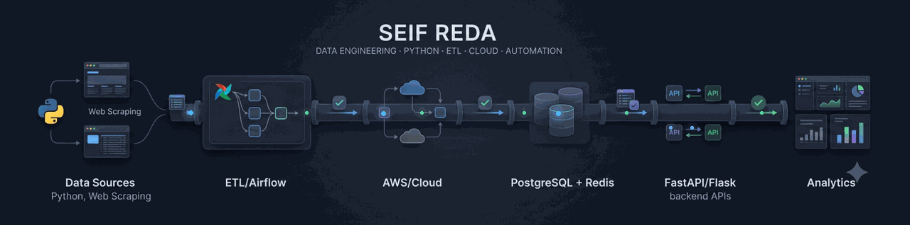

<h1 align="center">Hi 👋, I'm Seif Reda</h1>

  

  <b>Data Engineer · Python Backend Developer · ETL & Automation Specialist</b>

## 👨‍💻 About Me

I'm a **Data Engineer and Python Backend Developer** from Egypt with **3+ years of experience** building production ETL pipelines, backend APIs, data extraction systems, and automation.

My strongest areas are **Python, SQL, ETL/Airflow, AWS, PostgreSQL/Redis, FastAPI, web scraping, API reverse engineering, and data quality**.

## 🚀 What I Build

**Data Engineering** — large-scale extraction, ETL/ELT, Airflow orchestration, validation, normalization, deduplication, and analytics-ready data.

**Backend** — production FastAPI/Flask services, PostgreSQL/Redis, async Python, REST APIs, authentication, rate limiting, and event-driven workflows.

**Automation & Extraction** — Selenium/Playwright/BeautifulSoup, undocumented API integration, protected-source extraction, anti-bot/CAPTCHA workflows, and proxy/TLS handling.

**Cloud & Analytics** — AWS-based scheduled pipelines, Docker/GitLab CI/CD, PostgreSQL data platforms, and Power BI/DAX reporting.

> Some production systems are private because they were built for employers and clients; the descriptions above summarize the engineering work without exposing proprietary code or data.

## 🛠️ Core Stack

**Python · SQL · FastAPI · Flask · async SQLAlchemy · asyncpg · Pydantic · REST APIs · Swagger/OpenAPI**

**ETL/ELT · Apache Airflow · Pandas · NumPy · Data Validation · Normalization · Deduplication**

**Selenium · Playwright · BeautifulSoup · curl_cffi · API Reverse Engineering · Browser Automation · Anti-Bot/CAPTCHA Handling**

**AWS (ECS, Lambda, RDS, S3, EventBridge, CloudFront, ECR) · Docker · Linux · Git · GitLab CI/CD**

**PostgreSQL · Redis · MySQL · SQLite · Schema Design · Query Optimization · Indexing**

**pytest · Ruff · Black · Mypy · Structured Logging · Rate Limiting · Encryption**

**Power BI · DAX · Excel · Matplotlib · Seaborn · TensorFlow · Keras · scikit-learn · OpenCV**

## 💼 Professional Focus

**Data Engineering · Python Backend · ETL/ELT · Data Pipelines · API Engineering · Web Scraping · Data Extraction · Automation · Cloud Engineering · Analytics Engineering**

I'm especially interested in production environments built around:

**Python + SQL + ETL + AWS + PostgreSQL + Airflow**

**Python + FastAPI/Flask + PostgreSQL/Redis + REST APIs**

**Python + Selenium/Playwright + Web Scraping + API Integration + Automation**

## 🤝 Let's Connect

[LinkedIn](https://linkedin.com/in/seif-reda) ·
[Upwork](https://www.upwork.com/freelancers/seifeldeenr) ·
[Email](mailto:seifreda82@gmail.com)

---

  <i>Building reliable data systems, backend services, and automation with Python.</i>

